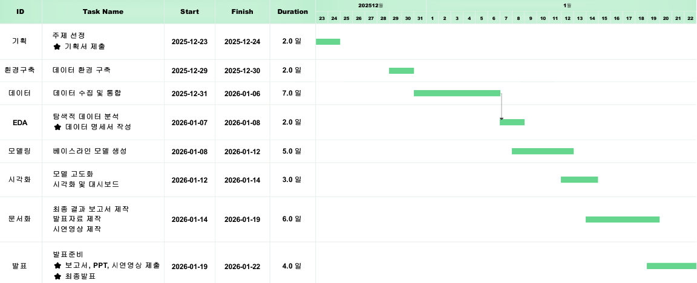

<div>
  
</div>

# 💲 금융 데이터 기반 최종 프로젝트 체크리스트 💲

> **팀명:** iM ONEderful  
> **진행 기간:** 2024.12.23 - 2025.01.22  
> **목표:** 금융 데이터 기반의 분석/모델링 프로젝트 완성 및 발표  
> **팀 운영 방식:** Daily Stand-up, 버전 통제, 산출물 관리 중심

---

## 📈 Gantt Chart

<div>
  
</div>

---

## 👨🏻‍💻 Members

<table align="center"?
    <tr>
        <td align="center">김수민</td>
        <td align="center">나효상</td>
        <td align="center">배수원</td>
        <td align="center">서범창</td>    
    </tr>
    <tr height="160px">
        <td align="center">
            
        </td>
        <td align="center">
            
        </td>
        <td align="center">
            
        </td>
        <td align="center">
            
        </td>
    </tr>
    <tr>
        <td align="center"><a href="https://github.com/sumin9716">🔗Github</a></td>
        <td align="center"><a href="https://github.com/TimePise">🔗Github</a></td>
        <td align="center"><a href="https://github.com/">🔗N/A</a></td>
        <td align="center"><a href="https://github.com/SeoBamm">🔗Github</a></td>
    </tr>
    <tr>
        <td align="center"><code>Project Manager</code>, <code>모델 개발</code>, <code>Insight</code></td>
        <td align="center"><code>데이터 수집</code>, <code>EDA</code>, <code>Full-Stack</code></td>
        <td align="center"><code>문서화</code>, <code>시각화</code></td>
        <td align="center"><code>모델 개발</code>, <code>EDA</code>, <code>Full-Stack</code></td>
    </tr>
</table>
    
---

## 📝 1) 매일 공통 체크리스트 (Daily)

### 🔹 시작 (아침)
- [ ] 팀 스탠드업 수행 — **오늘 목표 1~3개 확정**
- [ ] 역할/담당 확인 (PM · 전처리 · 모델 · 시각화 · 문서)
- [ ] 작업 파일/버전/경로 확인 (**충돌 방지**)

### 🔹 마감 (퇴근 전)
- [ ] 오늘 성과 공유 (팀 마무리 미팅)
- [ ] 일일진행일지 작성 완료
- [ ] 백업 완료 (**USB + 클라우드/Git**)
- [ ] 내일 할 일 3개 확정

---

## 🧭 2) 구간별 체크리스트 (프로젝트 진행용)

### 📅 1 - 2일차 (12/23 - 12/24) — 기획 / 주제 선정
- [x] 주제 확정 (단일 심화 / 복합)
- [x] 연구 목적·범위·성과지표(KPI) 확정
- [x] 팀 역할 분담 확정
- [x] 프로젝트 기획서 초안 → 최종본 완료
- [x] 기획서 제출 완료 (**변경 불가**)

**📄 산출물**
- [x] 프로젝트 기획서  
- [x] 일일진행일지  

---

### 📅 3 - 4일차 (12/29 - 12/30) — 환경 구축 / 데이터 이해
- [x] 분석 환경 구축 (라이브러리/버전 통일)
- [x] 데이터 로딩 및 구조 파악 (테이블/키/기간)
- [x] 결측치·이상치 1차 점검
- [x] 추가 데이터 수집 필요 목록 작성
- [x] 세부 연구 질문/가설 정리
- [x] 벤치마킹/선행사례 정리

**📄 산출물**
- [x] 일일진행일지  

---

### 📅 5 - 7일차 (12/31 - 01/06 오전) — 데이터 수집 / 통합 + 명세서
- [x] 데이터 수집 및 통합 (**무결성/중복/키 체크**)
- [x] 변수 정의/타입/범위/분포 정리
- [x] 결측/이상치 처리 기준 확정
- [x] 파생변수 후보 정의
- [x] 데이터 명세서 작성 완료

**📄 산출물**
- [x] 데이터 명세서  
- [x] 일일진행일지  

---

### 📅 7 - 9일차 (01/06 오후 - 01/08 오전) — EDA
- [ ] 기술통계(핵심 변수) 산출
- [ ] 그룹별 비교 (지역/업종/등급 등)
- [ ] 상관/연관성 분석 (히트맵 포함)
- [ ] 주요 인사이트 3~5개 도출 (그래프 + 한줄 해석)
- [ ] 다음 단계(모델링/검정) 방향 확정

**📄 산출물**
- [ ] 일일진행일지  

---

### 📅 9 - 11일차 (01/08 오후 - 01/12 오전) — 베이스라인 모델 & 검증
- [ ] 문제 정의 (분류 / 회귀 / 시계열 / 추천)
- [ ] 평가지표 확정 (F1 / AUC / RMSE / Precision@K 등)
- [ ] 데이터 분할 전략 확정 (누수 여부 포함)
- [ ] 전처리 파이프라인 구축 (인코딩, 스케일링 등)
- [ ] 베이스라인 모델 결과 확보
- [ ] 실험 로그 정리 (모델, 파라미터, 성능 기록)

**📄 산출물**
- [ ] 일일진행일지  

---

### 📅 11 - 13일차 (01/12 오후 - 01/14) — 모델 향상 + 시각화/인사이트
- [ ] 피처 엔지니어링 적용 (파생/변환/선택)
- [ ] 모델 개선 (튜닝·앙상블 등)
- [ ] 모델 비교표 작성 (베이스라인 vs 개선)
- [ ] 핵심 시각화 제작 (필수 차트)
- [ ] 액션 아이템 / 비즈니스 제언 정리

**📄 산출물**
- [ ] 일일진행일지  

---

### 📅 14 - 16일차 (- 01/19 오전) — 문서화 (보고서/PPT/시연)
- [ ] 최종보고서 목차·구조 확정
- [ ] 보고서 작성 완료 (배경~제언까지)
- [ ] PPT 스토리라인 및 슬라이드 구성 완료
- [ ] 시연 영상 제작 완료 (가이드 준수)
- [ ] 최종 결과물 제출 완료 (보고서·PPT·시연영상)

**📄 산출물**
- [ ] 최종 결과 보고서  
- [ ] 발표 자료 PPT  
- [ ] 시연 영상  
- [ ] 일일진행일지  

---

### 📅 16 - 19일차 (01/19 오후 - 01/22 오전) — 발표 준비
- [ ] 발표 1차 리허설 (시간 엄수)
- [ ] 피드백 반영 (PPT 오류·스토리 개선)
- [ ] Q&A 시나리오 준비
- [ ] 발표 2차 리허설 (실전처럼)
- [ ] 발표 파일 최종 백업 (USB / 클라우드)

**📄 산출물**
- [ ] 일일진행일지  

---

### 📅 19일차 (01/22) — 최종 발표 및 평가
- [ ] 장비 점검 (HDMI / 마이크 / 화면비율)
- [ ] 발표 리허설 30분 1회 완료
- [ ] 최종 발표 진행
- [ ] 프로젝트 평가지 작성 완료
- [ ] 전체 파일 제출 완료 (코드 / 문서 / 자료)

**📄 산출물**
- [ ] 프로젝트 평가지  

---

## ⏰ 3) 중요 마감 일정

| 날짜 | 시간 | 마감 내용 | 상태 |
|------|------|------------|------|
| **12/24 (화)** | 18:00 | 프로젝트 기획서 제출 (**변경 불가**) | ❌ |
| **01/19 (일)** | 13:00 | 보고서 · PPT · 시연영상 제출 | ❌ |
| **01/22 (수)** | 17:50 | 평가지 제출 | ❌ |
| **01/22 (수)** | 22:00 | 전체 파일 (코드 포함) 제출 | ❌ |

---

## 📂 Repository 구성

```
📦 iM_Digital_Banker_Final
├── 📁 data/ # 원본 및 전처리 데이터
├── 📁 code/ # Jupyter Notebook, Python 파일
├── 📁 docs/ # 보고서, PPT, 명세서
├── 📁 outputs/ # 결과물(그래프, 로그, 예측 결과 등)
├── 🛠️ .gitignore
└── 🛠️ README.md
```
