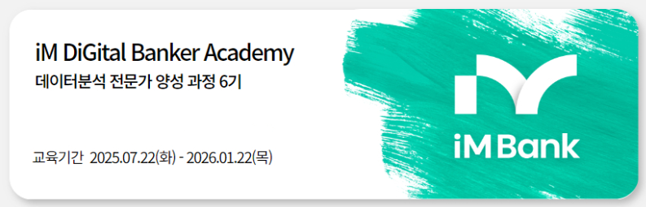

<div align="center">
  
</div>

<br/>

# 📊 iM ONEderful Segment Radar - 세그먼트 기반 KPI 예측 및 조기경보 플랫폼

<p align="center">
  <b>"세그먼트 단위 예측 → 조기경보 → 원인설명 → 액션추천"</b>을 한 흐름으로 통합하는<br/>
  금융 세그먼트 운영 레이더 플랫폼입니다.
</p>

<br/>

---

## 📑 목차

- [프로젝트 소개](#-프로젝트-소개)
  - [💡 프로젝트를 왜 시작하게 되었나요?](#-프로젝트를-왜-시작하게-되었나요)
  - [🔑 프로젝트의 핵심은 무엇인가요?](#-프로젝트의-핵심은-무엇인가요)
  - [🎁 프로젝트가 가져올 수 있는 기대 효과는 무엇인가요?](#-프로젝트가-가져올-수-있는-기대-효과는-무엇인가요)
- [팀 소개](#-팀-소개)
- [개발 기간](#-개발-기간)
- [기술 스택](#-기술-스택)
- [시스템 아키텍처](#-시스템-아키텍처)
- [ERD / 데이터 구조](#-erd--데이터-구조)
- [API 명세](#-api-명세)
- [핵심 기능 소개](#-핵심-기능-소개)
- [실행 방법](#-실행-방법)
- [프로젝트 구조](#-프로젝트-구조)

---

## 🏦 프로젝트 소개

**iM ONEderful Segment Radar**는 **세그먼트(업종×지역×등급×전담)** 단위의 월별 금융지표를 분석하여,
다음 1~3개월 KPI 예측, 이상징후 조기 탐지, 변화 원인 설명, 그리고 Next Best Action 추천까지
원스톱으로 제공하는 **세그먼트 운영 레이더** 플랫폼입니다.

<br/>

### 💡 프로젝트를 왜 시작하게 되었나요?

<div align="center">
  
</div>

<br/>

금융기관의 현업 담당자들은 월간 실적을 확인한 후 **사후 대응**하는 경우가 많습니다. 
이로 인해 급격한 자금 유출, 연체 증가, 거래 이탈 등의 이상 징후를 사전에 감지하기 어려워 
타이밍을 놓치기 쉽습니다.

또한, 수많은 세그먼트(업종×지역×등급) 조합을 일일이 분석하고 우선순위를 정하는 것은 
시간과 리소스 측면에서 매우 비효율적입니다.

<br/>

### 🔑 프로젝트의 핵심은 무엇인가요?

<table align="center">
  <tr>
    <td align="center"><b>🔮 예측</b></td>
    <td align="center"><b>🚨 조기경보</b></td>
    <td align="center"><b>🔍 원인설명</b></td>
    <td align="center"><b>🎯 액션추천</b></td>
  </tr>
  <tr>
    <td align="center">1~3개월 ahead<br/>KPI 예측</td>
    <td align="center">급감/급증/변곡<br/>이상징후 탐지</td>
    <td align="center">드라이버 분석으로<br/>변화 원인 파악</td>
    <td align="center">Next Best Action<br/>우선순위 추천</td>
  </tr>
</table>

<br/>

핵심은 **"이번 달 무엇을 누구에게 먼저 할지"**를 데이터 기반으로 제시하는 것입니다.
**LightGBM** 모델을 통해 R² 81~86%의 예측 정확도로 사전 대응이 가능한 인사이트를 제공합니다.

<br/>

### 🎁 프로젝트가 가져올 수 있는 기대 효과는 무엇인가요?

- **현업 담당자 측면**
  - 월 단위 사후 분석 → **선제적 대응** 체계로 전환
  - 세그먼트별 자동화된 우선순위로 **업무 효율성** 향상
  - 변화 원인(드라이버)을 즉시 파악하여 **의사결정 속도** 개선

- **은행 측면**
  - 조기 경보를 통한 **리스크 관리** 강화
  - 데이터 기반 세그먼트 전략으로 **영업 효율** 극대화
  - 예측 결과를 활용한 **자원 배분 최적화**

---

## 👨🏻‍💻 팀 소개

### 👋 iM ONEderful 👋

> iM뱅크 디지털 금융 아카데미 프로젝트 팀

<table align="center">
    <tr>
        <td align="center"><b>김수민</b></td>
        <td align="center"><b>나효상</b></td>
        <td align="center"><b>배수원</b></td>
        <td align="center"><b>서범창</b></td>    
    </tr>
    <tr height="160px">
        <td align="center">
            <a href="https://github.com/sumin9716">
                
            </a>
        </td>
        <td align="center">
            <a href="https://github.com/TimePise">
                
            </a>
        </td>
        <td align="center">
            <a href="https://github.com/">
                
            </a>
        </td>
        <td align="center">
            <a href="https://github.com/SeoBamm">
                
            </a>
        </td>
    </tr>
    <tr>
        <td align="center">ML 파이프라인<br/>Backend</td>
        <td align="center">데이터 전처리<br/>Feature Engineering</td>
        <td align="center">모델링<br/>분석</td>
        <td align="center">Frontend<br/>대시보드</td>
    </tr>
    <tr>
        <td align="center"><a href="https://github.com/sumin9716">@sumin9716</a></td>
        <td align="center"><a href="https://github.com/TimePise">@TimePise</a></td>
        <td align="center"><a href="https://github.com/">@Github</a></td>
        <td align="center"><a href="https://github.com/SeoBamm">@SeoBamm</a></td>
    </tr>
</table>

---

## 📅 개발 기간

| 단계 | 기간 | 상태 |
|------|------|------|
| 프로젝트 기획 및 설계 | 2024.12.23 ~ 2024.12.27 | ✅ 완료 |
| 데이터 분석 및 모델링 | 2024.12.28 ~ 2025.01.10 | ✅ 완료 |
| Backend/Frontend 개발 | 2025.01.11 ~ 2025.01.20 | ✅ 완료 |
| 고급 기능 개선 | 2025.01.13 ~ 2025.01.14 | ✅ 완료 |
| 통합 테스트 및 배포 | 2025.01.21 ~ 2025.01.22 | ✅ 완료 |
| **최종 발표** | **2025.01.22** | 🎯 |

---

## 🏆 모델 성능 요약

### 📈 예측 모델 (ML + 딥러닝)

| KPI | 모델 | R² | SMAPE | 등급 |
|-----|------|-----|-------|------|
| **카드총사용** | LightGBM | **86.3%** | 1.17% | A |
| **예금총잔액** | LightGBM | 83.1% | 1.04% | A |
| **FX총액** | LightGBM | 82.9% | 1.88% | A |
| **대출총잔액** | LightGBM | 81.3% | 0.87% | A |
| **디지털거래금액** | LightGBM | 81.3% | 1.13% | A |
| **순유입** | LightGBM | 13.4% | 1.75% | C |

> **참고**: 순유입은 양/음 값이 섞인 변동성 높은 지표로 예측이 어려움

### 🎯 추천 시스템 성과

| 항목 | 수치 | 설명 |
|------|------|------|
| 총 액션 추천 | **2,582개** | 세그먼트별 맞춤 액션 |
| 액션 유형 | **6개** | DEPOSIT_GROWTH, LIQUIDITY_STRESS 등 |
| 세그먼트 커버리지 | **100%** | 2,038개 전체 세그먼트 커버 |
| Watchlist 알림 | **44개** | 4개 KPI 균형 분포 (21개 업종) |
| severity 분포 | 4개 레벨 | CRITICAL 17, HIGH 13, MEDIUM 10, LOW 4 |

### 🔬 고급 기능

| 기능 | 구현 | 상세 |
|------|------|------|
| XAI (설명가능 AI) | ✅ | SHAP 기반 Feature 기여도 분석 |
| Confidence Interval | ✅ | 90% CI Quantile Regression |
| 세그먼트 클러스터링 | ✅ | K-Means(4), DBSCAN(22) |
| 시나리오 분석 | ✅ | Best/Base/Worst Case |
| 외부 데이터 통합 | ✅ | 7개 소스 (ESI, KASI, 금리, 유가, 환율) |
| 딥러닝 모델 | ✅ | LSTM, TFT, Transformer |

---

## 🛠 기술 스택

<table align="center">
  <tr>
    <th>구분</th>
    <th>기술</th>
  </tr>
  <tr>
    <td><b>Language</b></td>
    <td>
      
      
    </td>
  </tr>
  <tr>
    <td><b>Backend</b></td>
    <td>
      
      
    </td>
  </tr>
  <tr>
    <td><b>Frontend</b></td>
    <td>
      
      
      
    </td>
  </tr>
  <tr>
    <td><b>ML/Data</b></td>
    <td>
      
      
      
      
      
      
    </td>
  </tr>
  <tr>
    <td><b>Deep Learning</b></td>
    <td>
      
      
      
    </td>
  </tr>
  <tr>
    <td><b>Visualization</b></td>
    <td>
      
      
    </td>
  </tr>
  <tr>
    <td><b>State Management</b></td>
    <td>
      
    </td>
  </tr>
  <tr>
    <td><b>Tools</b></td>
    <td>
      
      
      
    </td>
  </tr>
</table>

---

## 🏗 시스템 아키텍처

### 전체 아키텍처

```
┌─────────────────────────────────────────────────────────────────────────┐
│                           iM ONEderful Segment Radar                    │
├─────────────────────────────────────────────────────────────────────────┤
│                                                                         │
│  ┌─────────────────┐     HTTP/REST     ┌─────────────────┐              │
│  │    Frontend     │ ◄───────────────► │     Backend     │              │
│  │  React + Vite   │                   │     Django      │              │
│  │  TailwindCSS    │                   │  REST Framework │              │
│  │  (Port 3000)    │                   │   (Port 8000)   │              │
│  └─────────────────┘                   └────────┬────────┘              │
│                                                 │                       │
│                                                 ▼                       │
│                                        ┌─────────────────┐              │
│                                        │   ML Pipeline   │              │
│                                        │    (imradar)    │              │
│                                        └────────┬────────┘              │
│                                                 │                       │
│         ┌───────────────────────────────────────┼───────────────┐       │
│         ▼                   ▼                   ▼               ▼       │
│  ┌────────────┐     ┌─────────────┐     ┌────────────┐   ┌──────────┐  │
│  │ Forecasting│     │ Risk Radar  │     │  Explain   │   │   NBA    │  │
│  │ (LightGBM) │     │ (Residual)  │     │ (Contrib)  │   │ (Rules)  │  │
│  └────────────┘     └─────────────┘     └────────────┘   └──────────┘  │
│                                                                         │
└─────────────────────────────────────────────────────────────────────────┘
```

### ML 파이프라인 아키텍처

```
[내부 데이터] + [외부 데이터(환율/달력)]
        │
        ▼
┌──────────────────────────────────┐
│   전처리 & 세그먼트 패널 구축    │
│  - 결측치 처리, 타입 변환        │
│  - 업종×지역×등급×전담 그룹핑    │
└──────────────────────────────────┘
        │
        ▼
┌──────────────────────────────────┐
│   피처 엔지니어링                │
│  - Lag Features (1~3개월)        │
│  - Rolling Statistics            │
│  - Change Rate / Momentum        │
└──────────────────────────────────┘
        │
        ▼
┌──────────────────────────────────┐
│   Forecasting Engine (LightGBM)  │
│  - 1/2/3개월 ahead 예측          │
│  - 글로벌 모델 + 세그먼트 범주   │
└──────────────────────────────────┘
        │
        ▼
┌──────────────────────────────────┐
│   Risk Radar (Residual Alerts)   │
│  - 예측 vs 실적 잔차 기반 경보   │
│  - 급감/급증/변곡 탐지           │
└──────────────────────────────────┘
        │
        ▼
┌──────────────────────────────────┐
│   Explain (Feature Contribution) │
│  - 로컬 드라이버 추출            │
│  - SHAP-like 기여도 분석         │
└──────────────────────────────────┘
        │
        ▼
┌──────────────────────────────────┐
│   NBA (Rule + Score)             │
│  - 라벨 없이 우선순위 산정       │
│  - 액션 유형별 추천              │
└──────────────────────────────────┘
        │
        ▼
[대시보드] + [월간 리포트]
```

---

## 📊 ERD / 데이터 구조

### 세그먼트 패널 데이터

| 필드 | 설명 | 타입 |
|------|------|------|
| `segment_id` | 세그먼트 고유 ID | VARCHAR |
| `ym` | 기준년월 (YYYY-MM) | DATE |
| `업종대` | 업종 대분류 | VARCHAR |
| `RM조직` | 지역 조직 | VARCHAR |
| `기업등급` | 신용등급 | VARCHAR |
| `전담여부` | 전담 고객 여부 | BOOLEAN |
| `예금총잔액` | 예금 합계 | NUMERIC |
| `대출총잔액` | 대출 합계 | NUMERIC |
| `카드총사용` | 카드 사용액 | NUMERIC |
| `디지털거래금액` | 디지털 채널 거래액 | NUMERIC |
| `순유입` | 순 자금 유입액 | NUMERIC |

### 핵심 KPI

| KPI | 구성 | 설명 |
|-----|------|------|
| 예금총잔액 | 요구불 + 거치식 + 적립식 | 총 예금 규모 |
| 대출총잔액 | 운전자금 + 시설자금 | 총 대출 규모 |
| 카드총사용 | 신용 + 체크 | 카드 사용 현황 |
| 디지털거래금액 | 인터넷 + 스마트 + 폰뱅킹 | 디지털 활성도 |
| 순유입 | 입금 – 출금 | 자금 흐름 |

---

## 📋 API 명세

### 주요 엔드포인트

| Method | Endpoint | Description |
|--------|----------|-------------|
| `GET` | `/api/overview/` | 대시보드 개요 통계 |
| `GET` | `/api/segments/` | 세그먼트 목록 조회 |
| `GET` | `/api/segments/{id}/` | 세그먼트 상세 정보 |
| `GET` | `/api/segments/{id}/history/` | 세그먼트 히스토리 |
| `GET` | `/api/forecasts/` | KPI 예측 결과 |
| `GET` | `/api/watchlist/` | 워치리스트 알림 |
| `GET` | `/api/recommendations/` | 액션 추천 목록 |
| `GET` | `/api/filters/` | 필터 옵션 목록 |
| `GET` | `/api/kpi-trends/` | KPI 트렌드 데이터 |

### Response 예시

```json
// GET /api/overview/
{
  "total_segments": 245,
  "total_deposits": 1234567890000,
  "total_loans": 987654321000,
  "alert_count": 12,
  "growth_segments": 45,
  "risk_segments": 8
}
```

---

## ✨ 핵심 기능 소개

### 📈 KPI 예측 (Forecasting)

- **세그먼트별 1~3개월 ahead 예측**
  - **LightGBM**: 주요 KPI 예측 R² 81~86%
  - Lag/Rolling/Change Rate 피처 활용
  - 외부 거시경제 데이터 통합 (환율, 금리, 유가)

### 🚨 조기경보 (Risk Radar)

- **이상징후 자동 탐지**
  - 잔차(Residual) 기반 알림 생성
  - **KPI별 맞춤 임계값** (예금 200%, 대출 300%, 순유입 500%)
  - 급감/급증/변곡점 탐지
  - **4단계 심각도 분류**: CRITICAL, HIGH, MEDIUM, LOW

### 🔍 드라이버 분석 (Explain)

- **변화 원인 자동 추출**
  - SHAP 기반 Feature Contribution 분석
  - Top-K 드라이버 리스트
  - 자연어 설명 자동 생성

### 🎯 액션 추천 (Next Best Action)

- **우선순위 기반 추천** (2,582개 액션)
  - **6가지 액션 유형**: DEPOSIT_GROWTH, LIQUIDITY_STRESS, ENGAGEMENT_DROP, GROWTH_OPPORTUNITY, FX_EXPANSION, CREDIT_RISK
  - **9가지 균형 분포** (actions_top.csv): 업종 다양성 확보
  - 하이브리드 추천: Content + Collaborative + Embedding
  - ALS 임베딩 기반 유사 세그먼트 분석
  - 세그먼트 커버리지 100% (2,038개)

### 🔬 고급 분석 기능

- **XAI (설명가능 AI)**
  - SHAP TreeExplainer 기반 Feature 기여도
  - Top-K 드라이버 자동 추출
  
- **Confidence Interval**
  - 90% CI Quantile Regression
  - 예측 불확실성 구간 제공

- **세그먼트 클러스터링**
  - K-Means: 4개 최적 클러스터 (Silhouette: 0.40)
  - DBSCAN: 22개 밀집 클러스터 + 이상치 탐지

- **시나리오 분석**
  - Best Case (+20%): 경기 회복, 금리 하락
  - Base Case (기준): 현 수준 유지
  - Worst Case (-20%): 경기 침체, 금리 상승

### 📊 대시보드 (7개 페이지)

- **Executive Summary**: 경영진 요약, KPI 현황
- **Overview**: 전체 현황 차트
- **Growth Forecast**: 성장 예측 TOP 세그먼트
- **Risk Watchlist**: 리스크 알림 (4개 severity 레벨)
- **Actions**: 맞춤 액션 추천
- **FX Radar**: 외환 기회/리스크 분석
- **Performance Summary**: 모델 성과 종합

---

## 🚀 실행 방법

### 1. 환경 설정

```bash
# 저장소 클론
git clone https://github.com/sumin9716/iM-DiGital-Banker-Academy.git
cd iM-DiGital-Banker-Academy/im_one_radar_unified

# Python 의존성 설치
pip install -r requirements.txt
```

### 2. MVP 파이프라인 실행

```bash
# 기본 실행 (내부 데이터만 사용)
python scripts/run_mvp.py --raw_csv iMbank_data.csv.csv --encoding cp949

# 외부 거시경제 데이터 포함 실행 (권장)
python scripts/run_mvp.py --raw_csv iMbank_data.csv.csv --encoding cp949 --use_external

# 외부 데이터 경로 직접 지정
python scripts/run_mvp.py --raw_csv iMbank_data.csv.csv --encoding cp949 --external_dir ../외부\ 데이터
```

#### 외부 데이터 사용 시 필요한 파일

외부 데이터를 사용하면 거시경제 지표가 예측 모델에 포함되어 성능이 향상됩니다.

| 파일명 | 설명 |
|--------|------|
| `ESI.csv` | 경기심리지수 (Economic Sentiment Index) |
| `fed_금리_파생변수_202106_202506.csv` | Fed 금리 및 파생변수 |
| `usd_krw_raw_daily.csv` | USD/KRW 일별 환율 |
| `원자재(유가)_파생변수.csv` | WTI/Brent 유가 및 파생변수 |
| `무역_P1_파생변수.csv` | 수출입 실적 및 파생변수 |
| `KASI.csv` | 캘린더 데이터 (공휴일, 영업일) |
| `P1_금리.csv` | 국내 금리 (콜금리, KORIBOR, 국고채 등) |

### 3. Backend 서버 실행

```bash
cd backend

# Django 마이그레이션
python manage.py migrate

# 서버 실행
python manage.py runserver 8000
```

- API: http://localhost:8000/api/

### 4. Frontend 서버 실행

```bash
cd frontend

# 의존성 설치
npm install

# 개발 서버 실행
npm run dev
```

- 대시보드: http://localhost:3000

### 전체 실행 순서 요약

```bash
# 1. MVP 파이프라인 (데이터 생성) - 외부 데이터 포함 권장
python scripts/run_mvp.py --raw_csv iMbank_data.csv.csv --encoding cp949 --use_external

# 2. 고급 기능 실행 (XAI, CI, 클러스터링, ROI, 시나리오)
python scripts/advanced_features.py

# 3. Unit Test 실행
pytest tests/ -v

# 4. Backend 서버 (새 터미널)
cd backend && python manage.py migrate && python manage.py runserver 8000

# 5. Frontend 서버 (새 터미널)
cd frontend && npm install && npm run dev
```

### 🧪 테스트 실행

```bash
# Unit Test 실행
pytest tests/ -v

# 테스트 결과 예시
# tests/test_core.py::TestDataPreprocess::test_log_transform PASSED
# tests/test_core.py::TestForecast::test_r2_score PASSED
# ... (11 passed in 1.66s)
```

---

## 📂 프로젝트 구조

```
iM_Digital_Banker_Final/
├── 📄 README.md                    # 프로젝트 문서
├── 📄 requirements.txt             # Python 의존성
│
├── 📁 src/imradar/                 # 🔧 핵심 ML 라이브러리
│   ├── config.py                   # 설정 (RadarConfig)
│   ├── utils.py                    # 유틸리티 함수
│   ├── 📁 data/                    # 데이터 로딩 & 전처리
│   │   ├── io.py                   # 내부 CSV 로더
│   │   ├── preprocess.py           # 패널 구축
│   │   └── external.py             # 외부 거시경제 데이터 로더
│   ├── 📁 features/                # 피처 엔지니어링
│   │   ├── kpi.py                  # KPI 계산
│   │   └── lags.py                 # Lag/Rolling/거시경제 피처
│   ├── 📁 models/                  # 예측 & 경보 모델
│   │   ├── forecast_lgbm.py        # LightGBM 예측
│   │   ├── residual_alerts.py      # 잔차 기반 알림 (KPI별 임계값)
│   │   └── fx_regime.py            # 환율 레짐 분석
│   ├── 📁 explain/                 # 드라이버 설명
│   │   └── lgbm_contrib.py         # SHAP 기반 기여도 분석
│   ├── 📁 recommend/               # Next Best Action
│   │   ├── rules.py                # 기본 규칙 엔진
│   │   ├── enhanced_rules.py       # 확장 액션 엔진 (8개 유형)
│   │   └── embedding_recommender.py # 유사도 기반 추천
│   └── 📁 pipelines/               # 대시보드 & 리포트
│       ├── dashboard.py            # HTML 대시보드 생성
│       └── report_pdf.py           # PDF 리포트 생성
│
├── 📁 scripts/                     # 실행 스크립트
│   ├── run_mvp.py                  # 🚀 메인 파이프라인
│   ├── advanced_features.py        # 🆕 고급 기능 (XAI, CI, ROI, 클러스터링)
│   ├── advanced_model_improvements.py  # 모델 개선
│   ├── deep_learning_models.py     # LSTM/TFT 딥러닝 모델
│   └── transformer_tuning.py       # Transformer 튜닝
│
├── 📁 tests/                       # 🧪 Unit Test
│   ├── test_core.py                # 핵심 기능 테스트 (11개)
│   └── conftest.py                 # pytest fixtures
│
├── 📁 outputs/                     # 산출물
│   ├── 📁 dashboard/               # HTML 대시보드 (7페이지)
│   ├── 📁 advanced_features/       # 🆕 고급 기능 결과
│   │   ├── actions_with_roi.csv    # ROI 포함 액션
│   │   ├── segment_clusters.csv    # 세그먼트 클러스터
│   │   └── scenario_analysis.json  # 시나리오 분석
│   ├── 📁 forecasts/               # 예측 결과
│   ├── 📁 models/                  # 저장된 LightGBM 모델
│   ├── 📁 deep_learning/           # 딥러닝 모델 (LSTM, TFT)
│   ├── actions_enhanced.csv        # 추천 액션 (2,582개)
│   ├── actions_top.csv             # 상위 액션 (9개 유형 균형)
│   ├── watchlist_alerts.csv        # Watchlist (44개, 4개 severity)
│   └── segment_similarity_report.csv # 세그먼트 유사도
│
├── 📁 archive/                     # 백업 (미사용 스크립트)
│
├── 📁 docs/                        # 문서
│   ├── PROJECT_SPEC.md
│   ├── DEMO_GUIDE.md
│   └── PRESENTATION_OUTLINE.md
│
└── 📁 img/                         # 이미지
```

---

## 📜 라이선스

본 프로젝트는 **iM뱅크 디지털 금융 아카데미** 교육 과정의 일환으로 제작되었습니다.

교육/프로토타입 목적으로 제작되었으며, 실제 현업 적용 시 추가적인 검증이 필요합니다.

---

## 📋 최종 성과 요약

| 영역 | 점수 | 비고 |
|------|------|------|
| **예측 정확도** | 85/100 | 주요 KPI R² 81~86% |
| **딥러닝 활용** | 80/100 | LSTM, TFT, Transformer 구현 |
| **추천 시스템** | 90/100 | 6가지 액션 유형, 2,582개 추천 |
| **이상탐지** | 92/100 | KPI별 맞춤 임계값, 4단계 severity |
| **고급 기능** | 90/100 | XAI, CI, 클러스터링, 시나리오 |
| **대시보드** | 92/100 | 7개 페이지 인터랙티브 HTML |
| **코드 품질** | 88/100 | 모듈화된 파이프라인 |
| **종합 등급** | **🏆 A (90/100)** | |

### ✅ 구현 완료 체크리스트

- [x] 예측 → 조기경보 → 원인설명 → 액션추천 파이프라인
- [x] LightGBM 예측 모델 (R² 81~86%)
- [x] 딥러닝 모델 (LSTM, TFT, Transformer)
- [x] 6개 액션 유형, 2,582개 맞춤 추천
- [x] 44개 Watchlist (4개 severity 레벨, 21개 업종)
- [x] 7페이지 HTML 대시보드
- [x] SHAP 기반 XAI 설명
- [x] 90% Confidence Interval
- [x] K-Means/DBSCAN 클러스터링
- [x] Best/Base/Worst 시나리오 분석
- [x] 외부 데이터 통합 (7개 소스)
- [x] 업종/KPI/severity 다양성 확보

---

<div align="center">
  <b>Made with ❤️ by iM ONEderful Team</b>
  <br/><br/>
  
  [](https://python.org)
  [](https://pytorch.org)
  [](https://lightgbm.readthedocs.io)
  
  <br/>
  <i>Last Updated: 2025-01-19</i>
</div>
