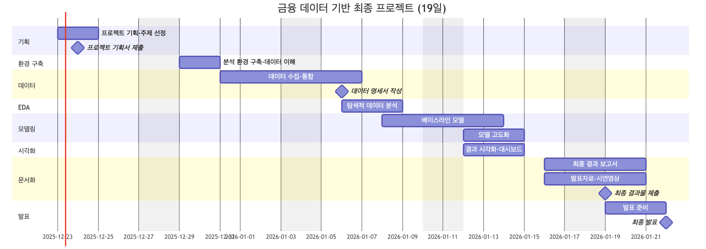

<div>
  
</div>

# 💲 iM ONEderful — 통합 세그먼트 레이더 (Unified) 💲

> **팀명:** iM ONEderful  
> **진행 기간:** 2024.12.23 - 2025.01.22  
> **목표:** 금융 데이터 기반의 분석/모델링 프로젝트 완성 및 발표

---

## 📋 프로젝트 개요

본 저장소는 **세그먼트(업종×지역×등급×전담) 단위** 월별 금융지표를 기반으로:
1. 다음 1~3개월 KPI를 **예측**하고  
2. 이상징후(급감/급증/변곡)를 **조기 탐지**하며  
3. 변화 원인을 **설명(드라이버)** 하고  
4. **"이번 달 무엇을 누구에게 먼저 할지" Next Best Action**을 추천하는  

**세그먼트 운영 레이더**를 구현하기 위한 통합 코드 베이스입니다.

확장으로 **환율 레짐 기반 FX Opportunity & Risk Radar** 모듈을 추가할 수 있도록 구조를 분리했습니다.

---

## 📈 Gantt Chart

<div>
  
</div>

---

## 👨🏻‍💻 Members

<table align="center">
    <tr>
        <td align="center">김수민</td>
        <td align="center">나효상</td>
        <td align="center">배수원</td>
        <td align="center">서범창</td>    
    </tr>
    <tr height="160px">
        <td align="center">
            
        </td>
        <td align="center">
            
        </td>
        <td align="center">
            
        </td>
        <td align="center">
            
        </td>
    </tr>
    <tr>
        <td align="center"><a href="https://github.com/sumin9716">🔗Github</a></td>
        <td align="center"><a href="https://github.com/TimePise">🔗Github</a></td>
        <td align="center"><a href="https://github.com/">🔗Github</a></td>
        <td align="center"><a href="https://github.com/SeoBamm">🔗Github</a></td>
    </tr>
</table>

---

## 📂 폴더 구조

```
im_one_radar_unified/
├── README.md                    # 이 파일 (통합 문서)
├── requirements.txt             # Python 의존성
├── iMbank_data.csv.csv          # 샘플 데이터
├── src/
│   └── imradar/                 # 핵심 라이브러리
│       ├── config.py            # 설정 (RadarConfig)
│       ├── utils.py             # 유틸리티 함수
│       ├── data/                # 데이터 로딩 & 전처리
│       │   ├── io.py
│       │   └── preprocess.py
│       ├── features/            # 피처 엔지니어링
│       │   ├── kpi.py
│       │   └── lags.py
│       ├── models/              # 예측 & 경보 모델
│       │   ├── forecast_lgbm.py
│       │   ├── fx_regime.py
│       │   └── residual_alerts.py
│       ├── explain/             # 드라이버 설명
│       │   └── lgbm_contrib.py
│       ├── recommend/           # Next Best Action
│       │   └── rules.py
│       └── pipelines/           # 대시보드 & 리포트 생성
│           ├── dashboard.py
│           └── report_pdf.py
├── scripts/
│   └── run_mvp.py               # MVP 파이프라인 실행 스크립트
├── data/
│   ├── raw/                     # 원천 데이터 저장 위치
│   └── external/                # 외부 데이터 (환율, 달력 템플릿)
│       ├── calendar_monthly_template.csv
│       └── usdkrw_monthly_template.csv
├── docs/
│   ├── PROJECT_SPEC.md          # 프로젝트 상세 스펙
│   ├── DEMO_GUIDE.md            # 발표/시연 가이드
│   └── PRESENTATION_OUTLINE.md  # 발표 구성 (10장)
├── outputs/
│   ├── dashboard/               # HTML 대시보드
│   │   ├── index.html           # 메인 네비게이션
│   │   ├── 01_overview.html
│   │   ├── 02_growth_forecast.html
│   │   └── 03_risk_watchlist.html
│   ├── forecasts/               # 예측 결과
│   ├── models/                  # 저장된 모델
│   └── *.csv                    # 경보/액션 결과
└── img/                         # 프로젝트 이미지
    ├── iM_DiGital_Banker.png
    └── gantt.png
```

---

## 🔧 1. 환경 설치

```bash
pip install -r requirements.txt
```

**주요 의존성:**
- pandas>=2.0
- numpy>=1.24
- scikit-learn>=1.3
- lightgbm>=4.0
- pyarrow>=14.0
- plotly>=5.20
- reportlab>=4.0

---

## 🚀 2. 실행 방법 (Quickstart)

### 2.1 MVP 파이프라인 실행

```bash
python scripts/run_mvp.py --raw_csv data/raw/iMbank_data.csv --encoding cp949
```

또는 루트의 샘플 데이터 사용:

```bash
python scripts/run_mvp.py --raw_csv iMbank_data.csv.csv --encoding cp949
```

### 2.2 산출물

실행 후 `outputs/` 아래에 생성:

| 파일 | 설명 |
|------|------|
| `segment_panel.parquet` | 세그먼트×월 패널 데이터 |
| `forecast_metrics.csv` | 모델 성능 지표 |
| `forecasts/segment_forecasts_next.csv` | 1~3개월 예측 결과 |
| `watchlist_alerts.csv` | 이상징후 워치리스트 |
| `watchlist_drivers.csv` | 드라이버 설명 |
| `actions_top.csv` | Next Best Action TOP |
| `dashboard/*.html` | 대시보드 (정적 HTML) |

---

## 📊 3. 핵심 KPI

### 메인 KPI
| KPI | 구성 |
|-----|------|
| 예금총잔액 | 요구불 + 거치식 + 적립식 |
| 대출총잔액 | 운전자금 + 시설자금 |
| 카드총사용 | 신용 + 체크 |
| 디지털거래금액 | 인터넷 + 스마트 + 폰뱅킹 |
| 순유입 | 요구불입금 – 요구불출금 |

### FX 확장 KPI
| KPI | 구성 |
|-----|------|
| FX총액 | 수출실적 + 수입실적 |

### 파생 KPI
- 한도소진율 = 대출잔액 / 여신한도
- 디지털비중 = 디지털거래 / 전체채널거래
- 자동이체비중 = 자동이체 / 전체채널거래

---

## 🎯 4. 시스템 아키텍처

```
[내부 데이터] + [외부 데이터(선택)]
        ↓
    전처리 & 세그먼트 패널 구축
        ↓
    피처 엔지니어링 (Lag/Rolling/Change)
        ↓
    ┌──────────────────────────────────┐
    │  Forecasting Engine (LightGBM)   │
    │  - 1/2/3개월 ahead 예측          │
    └──────────────────────────────────┘
        ↓
    ┌──────────────────────────────────┐
    │  Risk Radar (Residual Alerts)    │
    │  - 예측 vs 실적 잔차 기반 경보   │
    └──────────────────────────────────┘
        ↓
    ┌──────────────────────────────────┐
    │  Explain (Feature Contribution)  │
    │  - 로컬 드라이버 추출            │
    └──────────────────────────────────┘
        ↓
    ┌──────────────────────────────────┐
    │  NBA (Rule + Score)              │
    │  - 라벨 없이 우선순위 산정       │
    └──────────────────────────────────┘
        ↓
    [대시보드] + [월간 1-page 리포트]
```

---

## 📖 5. 발표/시연 가이드

자세한 내용은 [docs/DEMO_GUIDE.md](docs/DEMO_GUIDE.md) 참조

### 핵심 메시지 (30초)
- 현업은 월간 실적 확인 후 **사후 대응**이 많아 타이밍을 놓치기 쉽습니다.
- 본 MVP는 세그먼트 단위로 **예측 → 조기경보 → 원인설명 → 액션추천**을 한 흐름으로 통합합니다.

### 데모 흐름
1. **Overview** - 전체 KPI 전망 (`01_overview.html`)
2. **Growth Forecast** - 기회 타깃 (`02_growth_forecast.html`)
3. **Risk Radar** - 워치리스트 (`03_risk_watchlist.html`)
4. **Actions** - Next Best Action (`actions_top.csv`)

발표 슬라이드 구성은 [docs/PRESENTATION_OUTLINE.md](docs/PRESENTATION_OUTLINE.md) 참조

---

## 🔬 6. 기술 구현 상세

| 컴포넌트 | 방법론 |
|----------|--------|
| 예측 | LightGBM 글로벌 모델 (세그먼트 범주 + lag/rolling/exogenous) |
| 이상징후 | 예측 대비 잔차(residual) 기반 스코어링 |
| 설명 | `LightGBM.predict(pred_contrib=True)` 로컬 기여도 |
| 추천 | 라벨 부재 전제 → 룰 기반 후보 생성 + 스코어 우선순위 |

---

## ⚠️ 7. 주의사항

- 본 코드는 교육/프로토타입 목적의 MVP입니다.
- 실제 현업 적용 시:
  - 데이터 정의(합산 기준) 검증
  - 정책/규제/보안 요건 준수
  - 모델 검증/모니터링 체계 추가

---

## 🌐 8. 웹 애플리케이션 (Frontend + Backend)

### 아키텍처

```
┌─────────────────┐     HTTP/REST     ┌─────────────────┐
│    Frontend     │ ◄───────────────► │     Backend     │
│  React + Vite   │                   │     FastAPI     │
│  (Port 3000)    │                   │   (Port 8000)   │
└─────────────────┘                   └─────────────────┘
         │                                     │
         │                                     ▼
         │                            ┌─────────────────┐
         │                            │    outputs/     │
         │                            │  (CSV/Parquet)  │
         └────────────────────────────┴─────────────────┘
```

### 기술 스택

| 구분 | 기술 |
|------|------|
| **Backend** | FastAPI, Pydantic, Pandas, Uvicorn |
| **Frontend** | React 18, TypeScript, Vite, Tailwind CSS |
| **상태관리** | TanStack Query (React Query) |
| **차트** | Recharts |
| **HTTP** | Axios |

### 백엔드 실행

```bash
# 의존성 설치
cd backend
pip install -r requirements.txt

# 서버 실행 (개발 모드)
uvicorn main:app --reload --host 0.0.0.0 --port 8000
```

- API 문서 (Swagger): http://localhost:8000/docs
- API 문서 (ReDoc): http://localhost:8000/redoc

### 프론트엔드 실행

```bash
# 의존성 설치
cd frontend
npm install

# 개발 서버 실행
npm run dev
```

- 대시보드: http://localhost:3000

### 주요 API 엔드포인트

| 메서드 | 엔드포인트 | 설명 |
|--------|------------|------|
| GET | `/api/overview` | 대시보드 개요 통계 |
| GET | `/api/segments` | 세그먼트 목록 조회 |
| GET | `/api/segments/{id}` | 세그먼트 상세 조회 |
| GET | `/api/segments/{id}/history` | 세그먼트 히스토리 |
| GET | `/api/forecasts` | 예측 결과 조회 |
| GET | `/api/watchlist` | 워치리스트 알림 |
| GET | `/api/recommendations` | 액션 추천 목록 |
| GET | `/api/filters` | 필터 옵션 조회 |
| GET | `/api/kpi-trends` | KPI 트렌드 데이터 |

### 전체 실행 순서

```bash
# 1. MVP 파이프라인 실행 (데이터 생성)
python scripts/run_mvp.py --raw_csv iMbank_data.csv.csv --encoding cp949

# 2. 백엔드 서버 실행 (새 터미널)
cd backend && uvicorn main:app --reload --port 8000

# 3. 프론트엔드 서버 실행 (새 터미널)
cd frontend && npm install && npm run dev
```

---

## 📜 라이선스

교육/프로토타입 목적으로 제작되었습니다.
